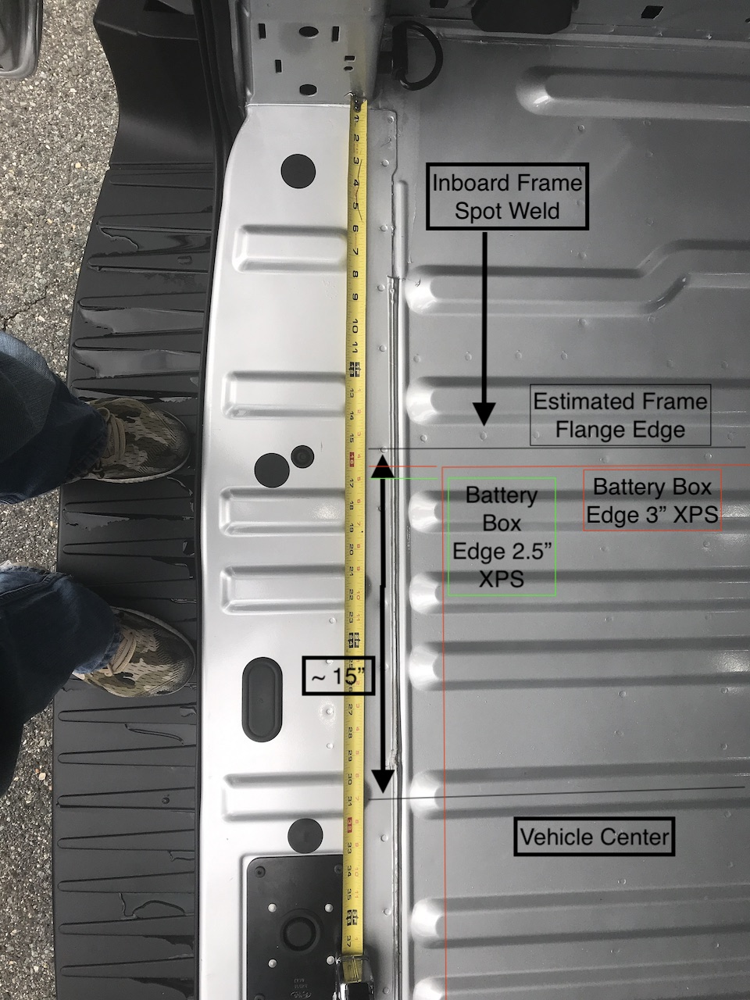

## Insulation and Thermal

With 3 inches of XPS on the sides of the battery, the total thermal resistance is 4.49 C/W.  This only accounts for the sides and bottom of the container.  A minimal 10 Watts would at steady state drive a delta-T of 44.9 C over outside ambient temperatures.   

With 2.5 inches of XPS on the sides of the battery, the total thermal resistance is 3.74 C/W.  This only accounts for the sides and bottom of the container.  A minimal 10 Watts would at steady state drive a delta-T of 37.4 C over outside ambient temperatures

| Variable Name           | XPS    | XPS    |
| ----------------------- | ------ | ------ |
| kappa [W/mK]            | 0.03   | 0.03   |
| Area [inch2] | 877.33 | 877.33 |
| Thickness [inch]        | 3.00   | 2.50   |
| Thickness [m]           | 0.08   | 0.06   |
| Area [m2]    | 0.57   | 0.57   |
| Resistance [C/W]        | 4.49   | 3.74   |

In both cases a small continuous 1-5 W heat source would keep things well above freezing assuming sub-zero outside temps.

Assuming 0.3 mOhm internal cell resistances, a 16 cell 24V battery will disipate 21W during a 200A charge.  This means the battery should exchange heat with the van internals via the top.  

However, we must account for the specific heat capacity of the bank itself.  [This paper](https://core.ac.uk/download/pdf/144147357.pdf) provides lumped parameter assumptions for LFP.  Using the more conservative value for specific heat capacity (825 J/kg*C), with a pack mass of 87kg (16 280HA cells), a two hour 200A charge produces a bulk temperature increase of 21W * 7200s / (87kg * 825 J/kg*C) = **2.1C**, assuming adiabatic conditions.  Given this view, overheating shouldn't be a problem even in summer as long is there is some communicaiton with the van interior.  

## Fitup and Dimensions

With 3" XPS on the largest battery under consideration with 3/16 inch wall thickness, the edge of the battery box lies close enough to the frame flange edge to prevent through-bolting the battery box flange.  For that design concept, it would be necesary to extend the box flange over the ridge inside the frame and use plus-nuts for fastening.

Alternatively, with 2.5" XPS there is enough room to through-bolt the box.  Through-bolting should simplify the installation.

TODO: Determine box flange - consider enough width to extend over the frame pinch welds for greater structural support under normal load (gravity)

TODO: Evaluate fore-aft dimensions.

